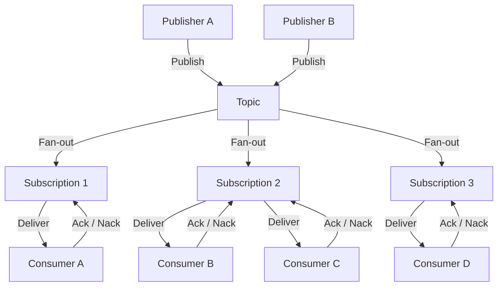
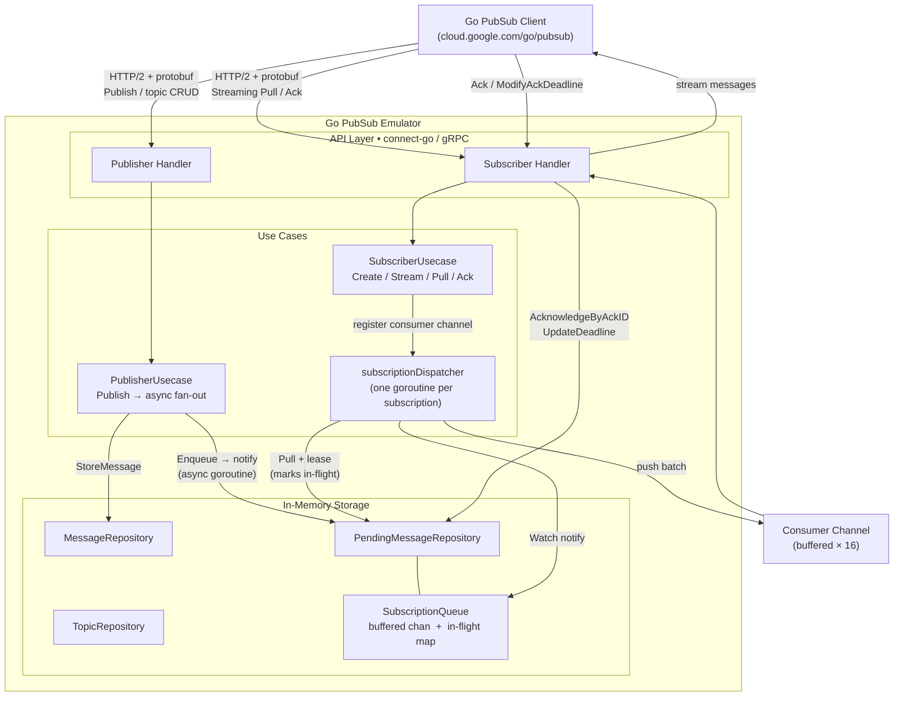

# google-pubsub-emulator

A lightweight Google Cloud Pub/Sub emulator written in pure Go.

The official Google emulator is a Java application packaged in a ~600 MB Docker image. This project implements the same gRPC API in Go, producing a **really small distroless image** that is fully compatible with the official [`cloud.google.com/go/pubsub`](https://pkg.go.dev/cloud.google.com/go/pubsub) client library.

<!-- Badges are auto-updated by .github/workflows/badges.yml on every push to main -->
| | Ours | Official (Java) |
|---|---|---|
| **Image size** |  |  |
| **Publish single** |  |  |
| **Publish batch/100** |  |  |
| **E2E latency** |  |  |
| **Coverage** |  | — |

> Badge colors: 🟢 green = on par or faster than official · 🟡 yellow = up to 5× slower · 🔴 red = >5× slower

## Features

- Full Publisher API — topics, publish, field-mask updates, retention
- Full Subscriber API — pull, streaming pull, ack/nack, dead-letter, ordering
- Snapshots — create, seek-to-snapshot, seek-to-time
- Init config — pre-create topics and subscriptions on startup
- Single static binary, scratch Docker image
- Validated against the real Google emulator with the same integration test suite

## Quick start

```bash
docker run --rm -p 8085:8085 ghcr.io/fbufler/google-pubsub:latest
```

Point your client at it:

```bash
export PUBSUB_EMULATOR_HOST=localhost:8085
```

### With an init config

Pre-create topics and subscriptions on startup by mounting a YAML file:

```yaml
# init.yaml
projects:
    - id: my-project
      topics:
          - name: orders
            subscriptions:
                - name: orders-processor
                  ack_deadline_seconds: 30
```

```bash
docker run --rm -p 8085:8085 \
  -e INIT_CONFIG=/etc/pubsub/init.yaml \
  -v $(pwd)/init.yaml:/etc/pubsub/init.yaml:ro \
  ghcr.io/fbufler/google-pubsub:latest
```

### docker-compose

```yaml
services:
    pubsub:
        image: ghcr.io/fbufler/google-pubsub:latest
        ports:
            - "8085:8085"
        environment:
            - INIT_CONFIG=/etc/pubsub/init.yaml
        volumes:
            - ./init.yaml:/etc/pubsub/init.yaml:ro
```

## Configuration

| Environment variable      | Default   | Description                                              |
| ------------------------- | --------- | -------------------------------------------------------- |
| `LISTEN_ADDR`             | `:8085`   | Address the server listens on                            |
| `INIT_CONFIG`             | _(unset)_ | Path to a YAML init config file                          |
| `PUBSUB_DELIVERY_DELAY`   | _(unset)_ | Artificial delay before delivering newly published messages (e.g. `50ms`, `200ms`) |
| `LOG_LEVEL`               | `info`    | Minimum log level: `debug`, `info`, `warn`, `error`      |
| `LOG_FORMAT`              | `json`    | Log output format: `json` or `text`                      |
| `OTEL_EXPORTER_OTLP_ENDPOINT` | _(unset)_ | OTLP HTTP endpoint for tracing; disabled when unset  |

### `PUBSUB_DELIVERY_DELAY`

Real Google Cloud Pub/Sub and the official Java emulator have inherent latency between a `Publish` call returning and the message being delivered to a subscriber — typically 100–500 ms for the real service and 10–50 ms for the Java emulator (JVM overhead + local HTTP). Our Go emulator has no such overhead: delivery completes in under 1 ms.

This becomes a problem for test code that uses a non-blocking send pattern like:

```go
// listener callback
select {
case eventChan <- event:
default:
    // discard — nobody is receiving yet
}

// ... do some work that triggers a publish ...

// test assertion
select {
case e := <-eventChan:  // expects event to arrive here
case <-time.After(5 * time.Second):
    t.Fatal("timed out")
}
```

With real Pub/Sub the message always arrives after the test reaches the assertion. With our emulator it can arrive before the `select`, hit the `default` clause, and be silently discarded — causing a spurious timeout.

Setting `PUBSUB_DELIVERY_DELAY=50ms` makes the dispatcher sleep before delivering newly enqueued messages, reproducing the latency gap that real Pub/Sub provides naturally. It has no effect on redelivery of expired leases (those are already time-gated by the ack deadline).

## Architecture

### How Pub/Sub works

Pub/Sub decouples producers from consumers through topics and subscriptions. Publishers send messages to a topic without any knowledge of who will receive them. The broker fans each message out to every subscription on that topic, and each subscription delivers independently to its own set of consumers.



Key properties:
- Every subscription receives every message independently — a slow consumer on S2 does not affect S1 or S3.
- A message is redelivered if the consumer does not acknowledge it before the ack deadline expires.
- Multiple consumers on the same subscription share the load (competing consumers); each message goes to exactly one of them.

### Emulator internals



**Publish path** — the `PublisherUsecase` stores the raw message and fans it out to all matching subscriptions in a background goroutine. Each subscription's `SubscriptionQueue` receives the pending messages and fires a `notify` signal.

**Delivery path** — each subscription has one `subscriptionDispatcher` goroutine that reacts to three events:

| Event | Trigger |
|---|---|
| `notify` | A new message was enqueued by a Publish |
| `trigger` | A new streaming-pull consumer registered (drains any backlog immediately) |
| requeue ticker (500 ms) | Redeliver messages whose ack deadline has expired |

On each event the dispatcher calls `deliver`, which pulls available messages from the queue, marks them in-flight, and pushes them to a registered consumer channel using round-robin. The streaming pull handler reads from that channel and sends the batch over the open HTTP/2 stream to the client.

**Ack path** — the client sends ack IDs back; the subscriber handler removes those messages from the in-flight map so they are never redelivered.

**`PUBSUB_DELIVERY_DELAY`** — when set, the dispatcher sleeps for the specified duration after receiving a `notify` or `trigger` signal before calling `deliver`. This simulates the natural latency of real Pub/Sub and the Java emulator. See the [configuration section](#pubsub_delivery_delay) for details.

## Development

### Prerequisites

Install [mise](https://mise.jdx.dev/) then run:

```bash
mise install
```

This installs Go, Task, buf, and golangci-lint at the versions defined in `mise.toml`.

### Proto toolchain

Proto code is generated with [buf](https://buf.build) using the [connect-go](https://connectrpc.com/docs/go/getting-started/) plugin, which produces clean idiomatic Go and is fully gRPC-compatible.

```bash
task proto:update    # pull latest spec from googleapis/googleapis
task proto:generate  # regenerate → gen/
```

### Integration tests

The test suite in `test/integration/` runs against a live emulator. It is skipped by default and enabled with the `integration` build tag.

To validate against the **real** Google emulator:

```bash
task test:integration:official
```

To validate against **our** emulator:

```bash
task docker:build
task test:integration:ours
```

All CI pipelines use [mise](https://mise.jdx.dev/) (`jdx/mise-action`) to install tools.

## License

Apache 2.0 and Beerware — if you use this and we ever meet, buy me a beer. 🍺
